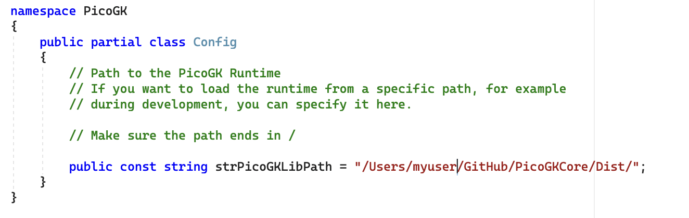

# Compiling the PicoGK Runtime

We compiled and tested PicoGKRuntime on Windows 64 bit and MacOS 14 Sonoma. Since Mac is our primary work environnment, we have tested it on Mac significantly more than on Windows. There is, however, nothing fundamentally platform-specific about PicoGK. The main platform dependencies are well-established libraries like OpenVDB. Our code is very straightforward and mostly header-only C++ code.

## What you need

On Windows, you need **Visual Studio 2022 Community Edition** (or higher) with C++ support installed (bare bones C++ is enough).

On Mac, you need the latest version of **XCode** with C++ support, and the XCode command line tools.

In addition you need a current version of **CMake** (Download at https://cmake.org/) and **Git** (Download at https://git-scm.com/downloads) — install both with the default settings, on Windows you need to restart so that Git can be found when using the command line.

## Installing dependent libraries

First clone the **PicoGKRuntime** repository to your machine. 

Make sure to initialize the submodules (**git submodule update --init --recursive**), so that the OpenVDB submodule is properly initialized.

PicoGKRuntime has no dependencies besides **OpenVDB** and **GLFW** (which is fetched automatically), but those libraries have plenty of dependencies (boost, blosc, etc).

To facilitate the installation of these dependencies, we have provided you with two scripts that download and install everything needed.

On Mac, please run **PicoGKRuntime/Install_Dependencies/Mac.sh**

On Windows, please run **PicoGKRuntime/Install_Dependencies/Win.bat** 

The installation of the dependencies may take a while, especially on Windows.

After you have done this, you can move onto compiling the PicoGK Runtime.

## Preparing the PicoGK Runtime Build Environment

Start the CMake GUI client and specify the path to the PicoGKRuntime repository in **"Where is the source code"**.

Specify the Build subfolder under **"Where to build the libraries"**. It should like this

Hit **Configure** and accept all defaults. After Configure has run without errors, click **Generate**.

Note: On Mac, we advise to use "Unix Makefiles" as target. If you target XCode, you will get an error in the OpenVDB CMake setup. We have reached out to the OpenVDB team why this happens. You can safely comment out the offending lines in the OpenVDB CMake files, but this should not happen and it seems like an issue on their side.

Now you can compile PicoGKRuntime on your system.

## Compiling

On Mac, go to the **Build** subdirectory in **Terminal** and type **make** [enter] to run the make tool. The build process should start and you will get the compiled picogk.1.0.dylib in the Dist subfolder of PicoGKRuntime.

On Windows, open the resulting project in Visual Studio and compile (use the release version).

## Using the compiled Runtime

You either copy the resulting library to /usr/local/lib on Mac or the System32 folder on Windows (or any other folder that is in your system path).

A cleaner way, when you are still testing is to modify the path in the PicoGK C# library. You do this by opening PicoGK__Config.cs and pointing the path to your compiled library:

One last thing — on Mac, you may have to sign the library using the **codesign** tool. Otherwise the library may not load. 

## Code signing on the Mac

The necessary command line is **codesign -s LEAP71 picogk.1.0.dylib** — you need to have a valid code signing certificate for this (we used one we named LEAP71 — you can self issue this certificate, but it's a few steps).

Here is a relevant Apple article how to create self-signed certificates: https://support.apple.com/en-ae/guide/keychain-access/kyca8916/mac

[You may have to adjust your security settings as described here.](../Runtime/readme.md)
