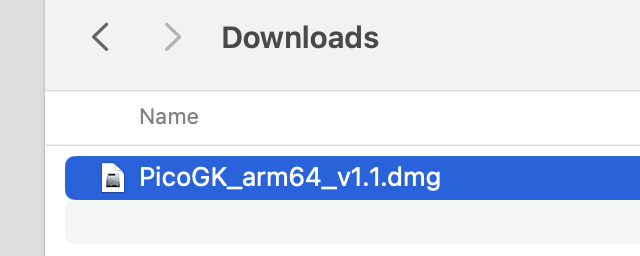
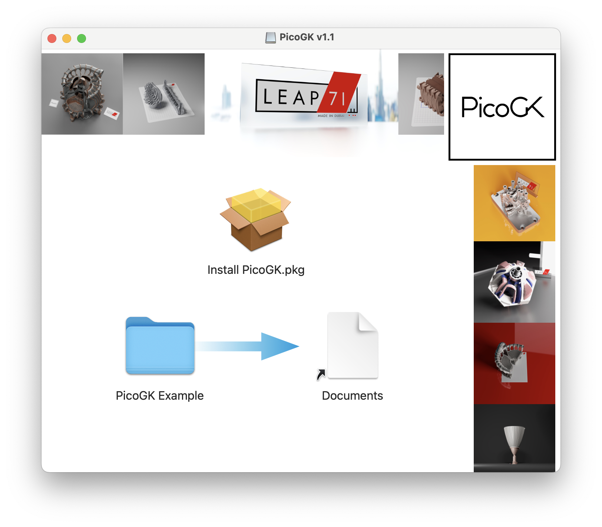
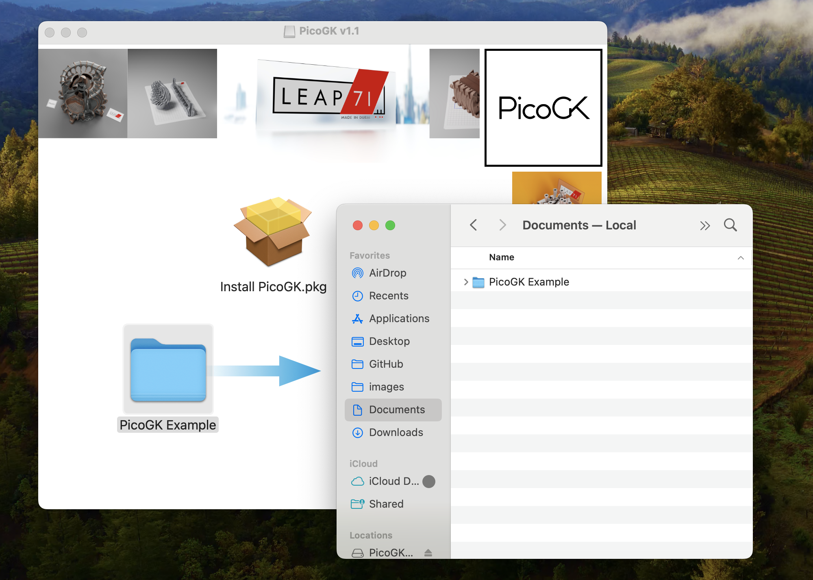
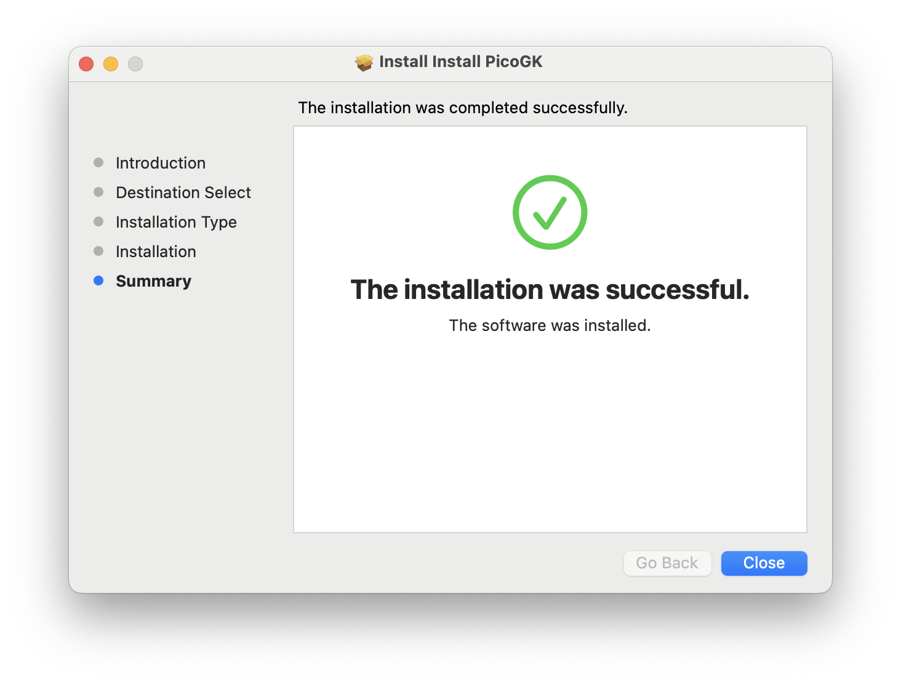

# Installing on macOS

## Installing the PicoGK Runtime

At this time, we have installers for macOS on Apple Silicon (M1 upwards). There is no Intel support yet (you can compile on an Intel Mac, but we do not have Intel machines.).

[Download the macOS installer disk image of the latest release.](https://github.com/leap71/PicoGK/releases)

Double click the disk image and accept the license agreement. The disk image opens.

Copy the PicoGK Example project from the disk image to your Documents folder (or wherever you want to have it).

Double click **on Install PicoGK.pkg**

The PicoGK Installer will open.

Accept all defaults and install the PicoGKRuntime.

## Next: Installing Visual Studio

Next you have to decide, whether you want to use **Visual Studio 2022**, or **Visual Studio Code**. 

**Visual Studio 2022** has been end-of-lifed for macOS, unfortunately, as it was the easer-to-use product. It still works fine, though, for the time being.

**Visual Studio Code** is the cross platform integrated development environment for macOS, Windows and LINUX. It's a bit harder to use, but it is Microsoft's supported platform.

- [Install Visual Studio Code](VisualStudioCode_FirstTime.md)

- [Install Visual Studio 2022](VisualStudio_FirstTime.md)

