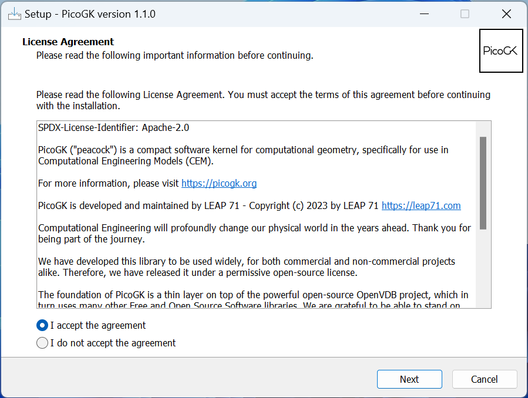
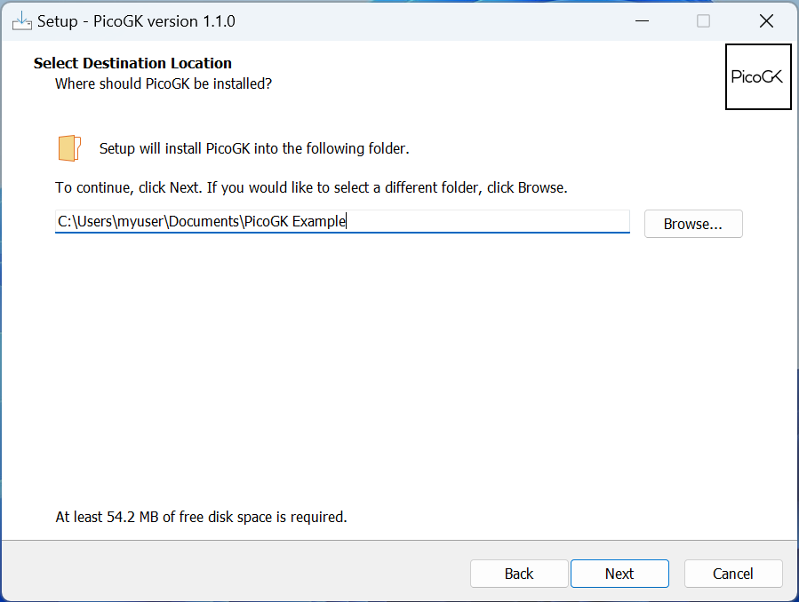
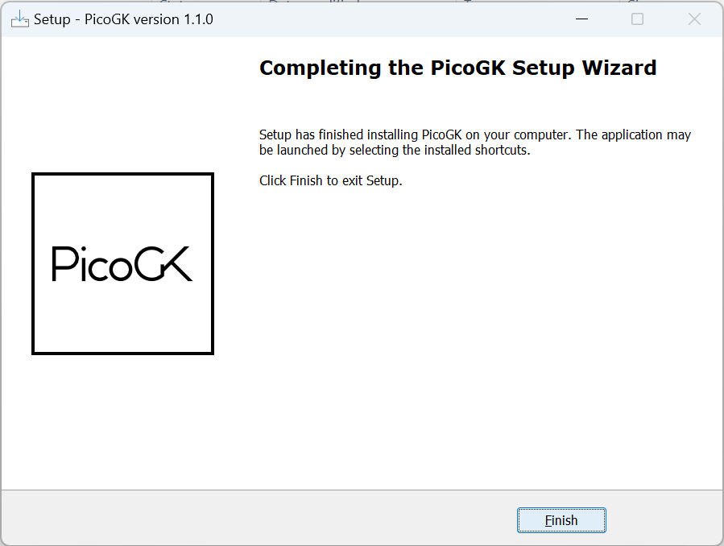

# Installing on Windows

## Installing the PicoGK Runtime

At this time, we support Windows 10/11 on 64 bit machines. [You can download the latest installers here.](https://github.com/leap71/PicoGK/releases)

After downloading the installer, run it and accept the licensing terms.

Choose were to install the PicoGK example project files.

Click Next and accept all defaults until the installer finishes.

## Next: Installing Visual Studio

Next you have to decide, whether you want to use **Visual Studio 2022**, or **Visual Studio Code**. 

**Visual Studio 2022** Is the easier-to-use product, we recommend using it on Windows.

**Visual Studio Code** is the cross platform integrated development environment for macOS, Windows and LINUX. It's a bit harder to use, but if you switch between macOS and Windows frequently, it's a good choice.

- [Install Visual Studio 2022](VisualStudio_FirstTime.md) (recommended)

- [Install Visual Studio Code](VisualStudioCode_FirstTime.md)
