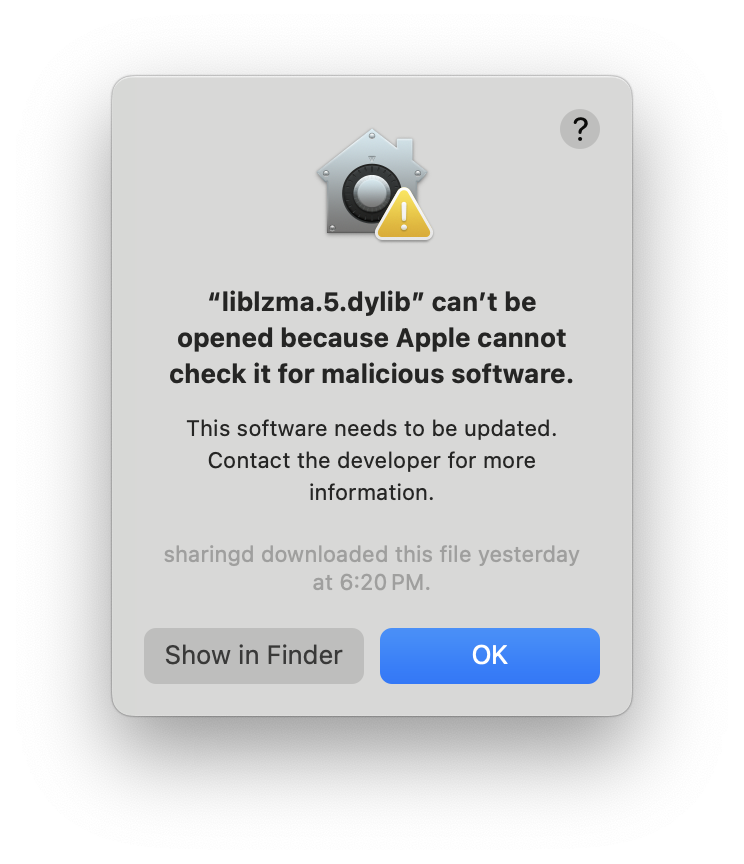
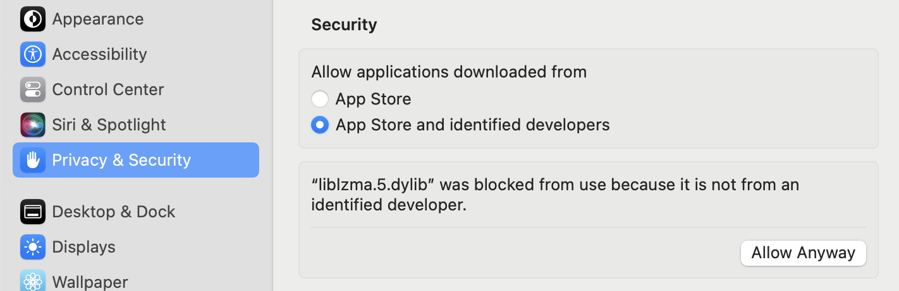
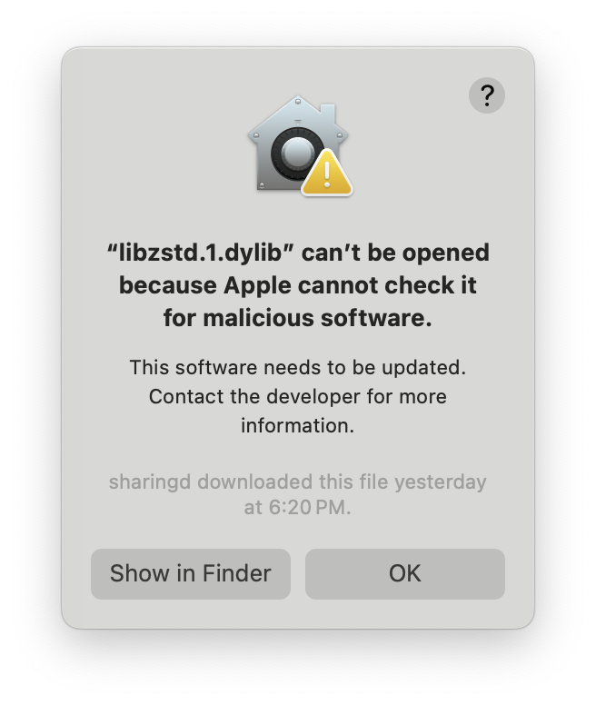
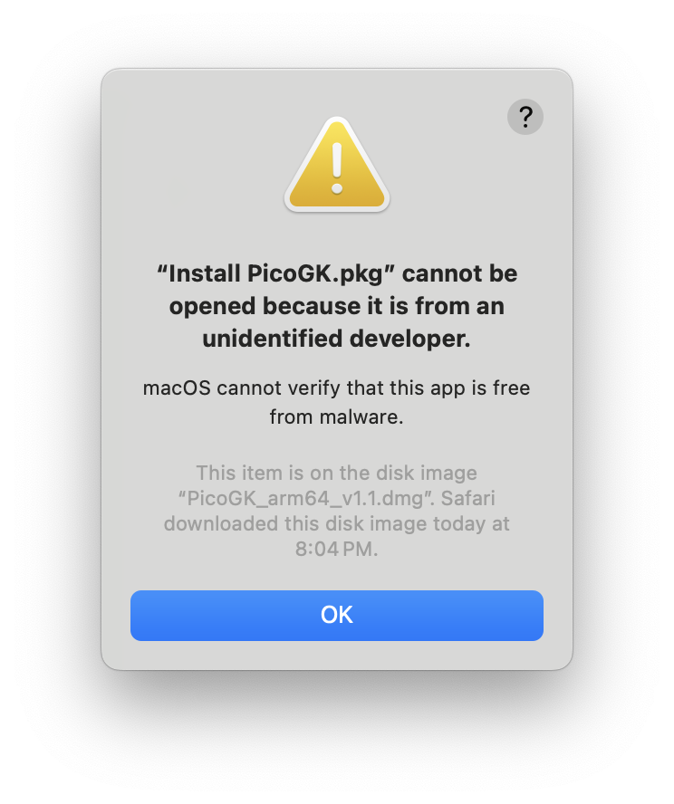
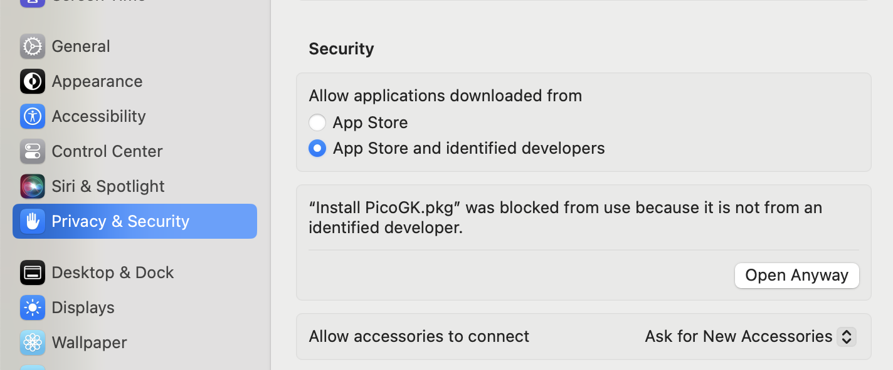
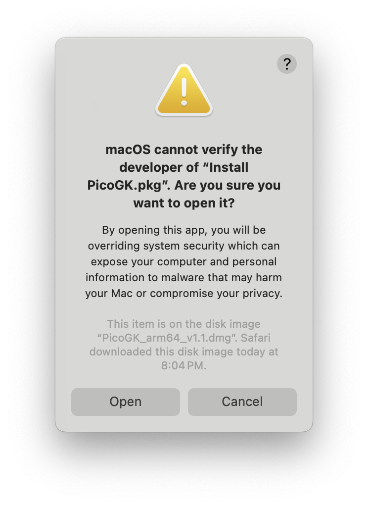
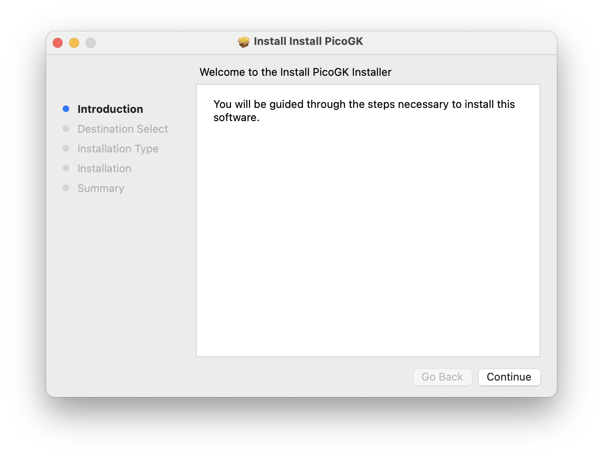

# Mac Security Warnings

Since we provide the installers as a convenience to this open source project, we have not signed them yet (we are working on this).

As a result, you will be confronted with a number of security warnings. If you don't trust us, you can [always compile yourself.](Compiling_PicoGKRuntime.md)

But if you **do** trust us, here is how to get it up an running on the Mac.

There are two security warning scenarios:

- Warning on first launch of a PicoGK project on your system
- [Warning when using the Installer package](#Warning-when-running-the-installer)

## Warning at first launch

When you run a PicoGK project for the first time, it may warn you that the developer of a number of libraries cannot be verified. These are dependencies of OpenVDB. The first library you will encounter is **liblzma.5.dylib** 

To trust this library, go to your **Privacy and Security** settings in System Preferences.

Click on Allow Anyway and confirm with your credentials. When you restart, you may be asked if you really trust this library, and have to confirm again.

PicoGK will then try to load the second library, so you will receive a message again, this time for **libzstd.1.dylib**

Follow the same process, and you should be up and running.

## Warning when running the installer

You get a warning that the installer package cannot be verified (our installers are not code-signed).

Go to System Settings and under **Privacy and Security** 

Make sure **App Store and identified developers** is enabled. Then click on **Open Anyway**.

 After entering your credentials, the following dialog pops up.

Choose **Open**

The PicoGK Installer will open.

