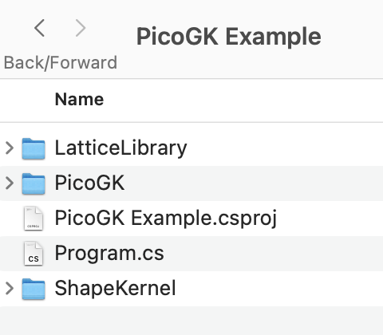
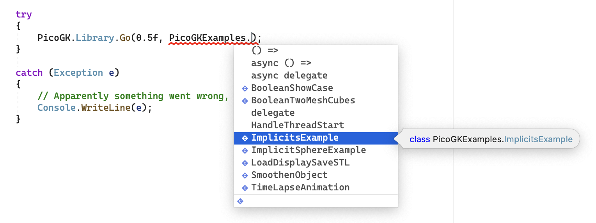
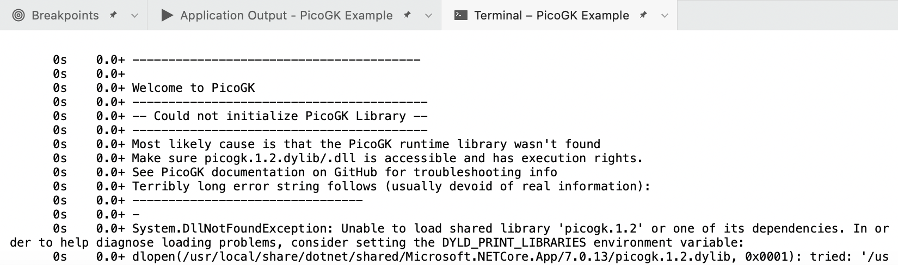
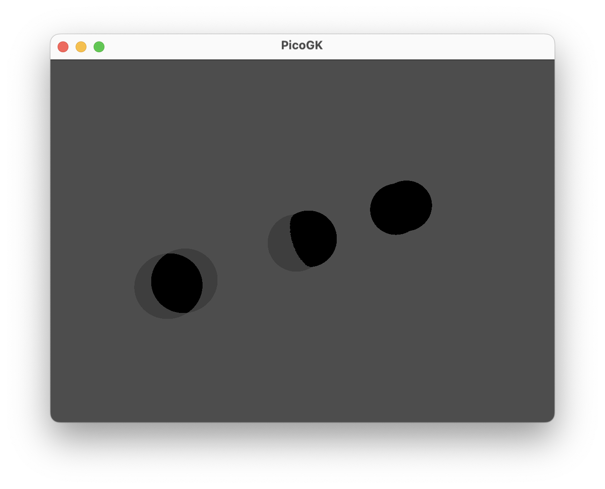

# PicoGK Documentation


## Getting Started

As a Computational Engineer, you write code to create sophisticated geometry. If you don't know how to code, there are many good tutorials available online. 

PicoGK uses the C# language, a modern, fast, expressive and strongly-typed language that allows you to build complex algorithms using a simple syntax. If you are new to coding, don't despair! We have tried to make it as simple as possible to get started.

The easiest way to get started [is to use the installers to install PicoGK on your machine](https://github.com/leap71/PicoGK/releases). 

- [Here is how to install on MacOS X](Install_Mac.md)

- [Here is how to install on Windows](Install_Windows.md)

You also need either [Visual Studio](https://visualstudio.microsoft.com/vs/getting-started/) or [Visual Studio Code](https://code.visualstudio.com/) — generally speaking Visual Studio is a bit easier to set up (it has been discontinued on Mac, but will work for another year or so).

- [Installing Visual Studio](VisualStudio_FirstTime.md)

- [Installing Visual Studio Code](VisualStudioCode_FirstTime.md)

## Folder structure of a PicoGK project

Generally speaking, your PicoGK projects will look like this:



/**PicoGK Example** (your project folder)

- **Program.cs** (your main execution code)
- ... other files (for example the Visual Studio project file)
   - **/PicoGK** (contains the PicoGK submodule)
   - **/ShapeKernel** (contains the LEAP71_ShapeKernel submodule)
   - **/LatticeLibrary** (contains the LEAP71_Lattice submodule)
   - ... other submodules

**Program.cs** contains the code that executes your program. The PicoGK subfolder contains the source code of the PicoGK library. Under the hood PicoGK's C# code calls the PicoGK C++ runtime library for the heavy lifting. As many functions as possible are implemented directly in C# code, to make it simple to understand what is actually going on. Feel free to step into all functions using the debugger.

If you have installed PicoGK using the installer, it you already have an example project in your **Documents** folder named **PicoGK Example**, which is ready to run.

## Running your first PicoGK App

Opening and running your first PicoGK app looks a bit different between VisualStudio Code and VisualStudio. If you are new to this, here are detailed steps:

- Running PicoGK Example on [VisualStudio](VisualStudio_FirstTime.md#Running-the-PicoGK-Example-Project)
- Running PicoGK Example on [VisualStudio Code](VisualStudioCode_FirstTime.md#Opening-and-running-the-PicoGK-test-project-in-Visual-Studio-Code)

Open **Program.cs** and you will see the following code.

```c#
try
{
	PicoGK.Library.Go(0.5f, PicoGKExamples.BooleanShowCase.Task);
}

catch (Exception e)
{
	// Apparently something went wrong, output here
	Console.WriteLine(e);
}
```

Inside the **try** block is the call to the PicoGK Library to run the task **PicoGKExamples.BooleanShowCase.Task** with a voxel size 0.5mm. 

If something goes wrong in this task, an exception (an error) is thrown. The error will then be printed to the console output, so you can understand what went wrong.

You can run your first project by pressing the F5 key (or choosing Run). If everything goes right, this is what you see. 


The example showcases a few boolean operations. 

**If it looks like that, congratulations, you are up and running!**

You can browse to the [PicoGK/Examples/Ex_BooleanShowCase.cs](https://github.com/leap71/PicoGK/blob/main/Examples/Ex_BooleanShowCase.cs) file and check out the code. 

On Mac, you will get a few **security warnings** that are a tedious, because our libraries are unsigned. [Here is how to solve this](MacSecurity.md).

What you have on screen is the **PicoGK Viewer**. You can click and drag in the viewer to rotate, scroll to zoom, and use the cursor keys to rotate by 15º. The viewer may seem basic but has many powerful functions, including the ability to show objects in multiple colors, animate the view, save screenshots and even create timelapse animations. If you like to test this out, check out the the [PicoGKExamples.TimeLapseAnimation.Task](https://github.com/leap71/PicoGK/blob/main/Examples/Ex_TimelapseAnimation.cs). We have animated entire gear trains and other moving objects in the viewer.

## Creating your own app

One of the easiest ways to get set up, is to simply copy the example to a new directory and rename the project file. Alternatively, If you know how to use Git/GitHub, here are the steps to create a new app:

- [Create a new **C# Console Project**](VisualStudio_CreateConsole.md) and add it to Git
- **Add PicoGK as submodule** using Git, and initialize it
- Add [LEAP71_ShapeKernel](https://github.com/leap71/LEAP71_ShapeKernel) and other [modules](https://github.com/leap71?tab=repositories) as needed.
- In your Program.cs, call **Library.Go()** with the appropriate parameters

## What's next?

Check out the other examples from the Examples subdirectory of PicoGK. A fun way to work your way through is by simply typing a **dot** behind the **PicoGKExamples** namespace ID, as below, and you will see all the options. Just don't forget to add **Task** at the end.



If you look at the code, you will see that it's super simple to create interesting things, even with the basic PicoGK functions.

If you want to seriously dive in, **[you should work using the LEAP 71 Shape Kernel.](https://github.com/leap71/LEAP71_ShapeKernel)** and build your [Computational Engineering Models](https://leap71.com/computationalengineering/) on top.

[Check out the main LEAP 71 GitHub page for more modules and links to articles.](https://github.com/leap71)

If you'd like to jump into the details of compiling and developing the [PicoGKRuntime, you will find a setup guide here](Compiling_PicoGKRuntime.md).

## Troubleshooting

### Cannot install on Mac, because of security warnings

At this time, both our installers and our libraries are not signed. So macOS will refuse to run the installer. [You can solve this by following these steps.](MacSecurity.md)

### First time I run on Mac, I get multiple security warnings

Same as above, this is because our runtime libraries and their dependencies are not signed (yet). [Here's how to fix this.](MacSecurity.md)

### PicoGK.log

PicoGK writes a detailed log of what is going on into **PicoGK.log**, which, by default, is located in your **Documents** folder. If you don't want us to spam your Documents folder, simply provide the path as the third parameter like this:

```c#
PicoGK.Library.Go(0.5f, PicoGKExamples.BooleanShowCase.Task, "/Users/username/Documents/LogMeHere");
```

 It must be an existing folder.

### I get a salad of errors and nothing works

The most likely issue is that the PicoGKRuntime library is not installed on your system. Unfortunately the error message that VisualStudio shows looks like this and is barely decipherable:



If you installed from the installers, this should not happen. If you compiled yourself, either the library or one of the dependencies is missing, or the library is not signed and thus not loadable.

### My viewer is dark



If your viewer looks like this, then the PicoGK Viewer did not find the textures for the image-based lighting environment. The most likely case is that your folder structure is different from what we described in the first steps of this document. **PicoGK Viewer assumes that PicoGK is in a subfolder named PicoGK** directly in your main project directory. If this isn't the case, it cannot find the file **PicoGK/ViewerEnvironment/PicoGKDefaultEnv.zip** and the scene is unlit. The easiest way to solve this is to follow the folder structure we described. Alternatively, you can provide a path to the ViewerEnvironment in a parameter to Library.Go.

### Where can I get help

PicoGK is open source and there is no support or dedicated team to answer questions. But [drop us a note in the discussion section of the PicoGK repository](https://github.com/leap71/PicoGK/discussions), if you have any issues, and we will do our best to help.


