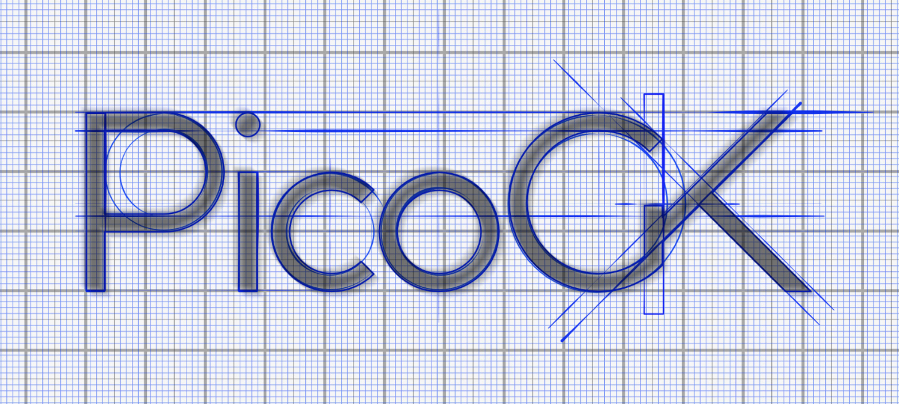
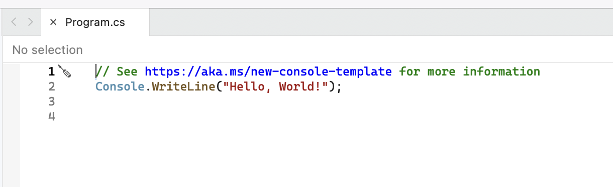
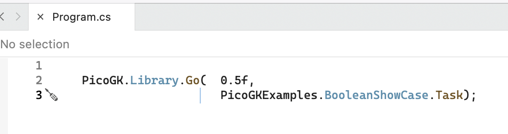

# PicoGK Documentation



## Getting Started

**PicoGK is available and tested on MacOS X at this time. A Windows release will follow in the coming weeks.**

As a Computational Engineer, you write code to create sophisticated geometry. If you don't know how to code, there are many good tutorials available online. 

PicoGK uses the C# language, a modern, fast, expressive and strongly-typed language that allow you to build complex algorithms using a simple syntax. If you are new to coding, don't despair! We have tried to make it as simple as possible to get started.

To install PicoGK, [follow this link](installation.md) for installation instructions.

Now let's dive in.

## Your first PicoGK App

For experts, here are the quick steps: In your **Program.cs** you call **PicoGK.Library.Go** with the voxel size and the task you want to execute. There are many example tasks in the **Examples** subfolder of the PicoGK repository.

**For detailed steps, read on.**

We assume you have followed the [Installation Guide](installation.md) and have created an empty Console application in Visual Studio.

Open your Visual Studio project. **Program.cs** should already be open.

It should look something like this



Replace the text there with the following:

```c#
PicoGK.Library.Go(  0.5f, 
                  	PicoGKExamples.BooleanShowCase.Task);
```



And run it.

If everything is right, a window will open, showing you a few spheres that are combined using Boolean operations. You can click and drag in the viewer to rotate, scroll to zoom, and use the cursor keys to rotate by 15º. The viewer is basic but functional.

If you are not seeing this window, you can check out the console window at the bottom of Visual Studio to see any error messages. These messages are also written to **PicoGK.log** in your Documents folder (you can change the location if you don't like that). One thing you may have to do on [Mac is adjust the security settings](../Runtime/README.md), so PicoGK can load the pre-compiled PicoGKRuntime. [If you want to compile it yourself, here are the instructions](Compiling_PicoGKRuntime.md).

[Drop us a note in the discussion section of this repository](https://github.com/leap71/PicoGK/discussions), if you have any issues, and we will do our best to help. The most common problem is that the PicoGK Runtime library cannot be found. Double check if you copied it to the right system folder.

Congratulations, you can now code in PicoGK!

Check out the other examples from the Examples subdirectory of PicoGK. A fun way to work your way through is by simply typing a dot behind the PicoGKExamples namespace ID, as below, and you will see all the options. Just don't forget to add "Task" at the end.

If you look at the code, you will see that it's super simple to create interesting things, even with the basic PicoGK functions.

If you want to seriously dive in, [you should work using the LEAP 71 Shape Kernel.](https://github.com/leap71/LEAP71ShapeKernel) and build your [Computational Engineering Models](https://leap71.com/computationalengineering/) on top.

If you'd like to jump into the details of compiling and developing the [PicoGKRuntime, you will find a setup guide here](Compiling_PicoGKRuntime.md).
