# Installing and running Visual Studio Code

**Note** we show Mac screenshots. Windows is similar. 

On Windows you [might want to consider using Visual Studio 2022](VisualStudio_FirstTime.md) and not Visual Studio Code. Visual Studio 2022 is the more comfortable development environment.

## Install the .NET SDK from Microsoft

[Download and install the latest .NET SDK from Microsoft](https://dotnet.microsoft.com/en-us/download/dotnet/sdk-for-vs-code) — we use version 8.0.

## Install Visual Studio Code

[Download Visual Studio Code from Microsoft](https://code.visualstudio.com).

After you downloaded it, drag and drop the app to your **Applications** folder. **Do not launch it from your Downloads folder directly.**

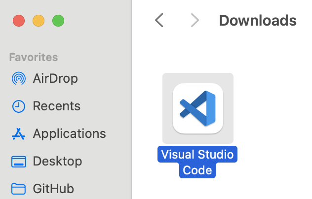

Launch Visual Studio Code from the **Applications** folder

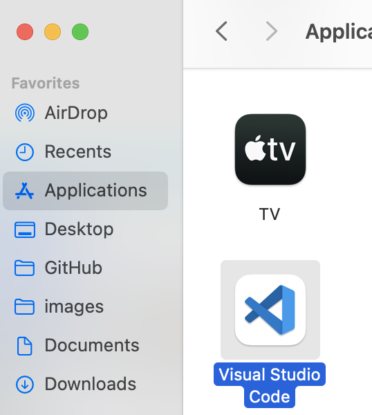

You can customize Visual Studio (we prefer bright looks!). When you are done, click on the extensions button on the left.

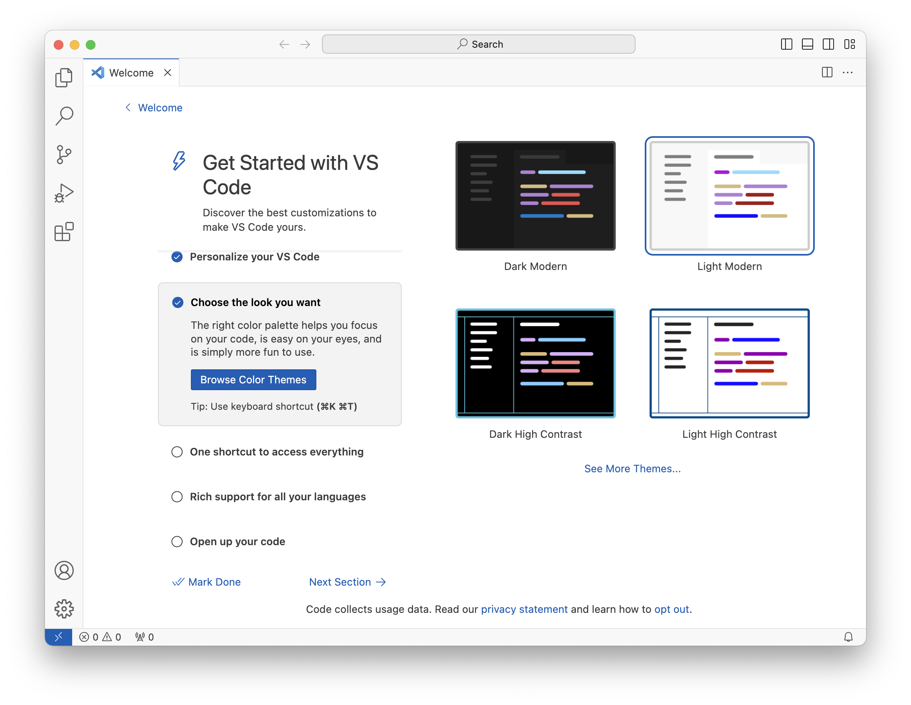

Type **C#** into the search field and install the C# Dev Kit. This will also install the C# base language support.

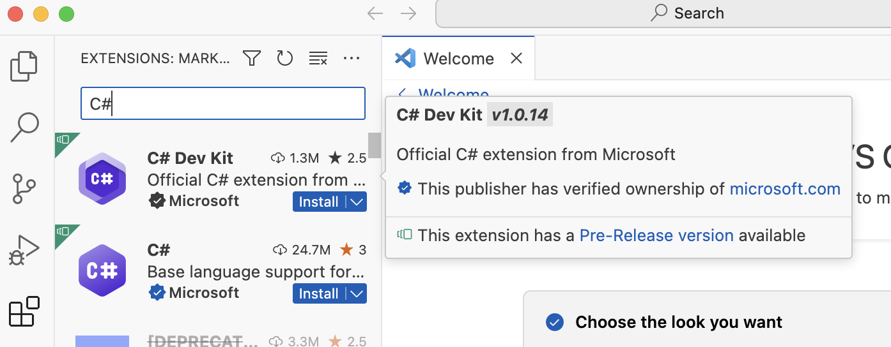

The download and installation will take a moment, depending on your internet speed.

After you are done with all this, **it's a good idea to restart Visual Studio Code.**

## Creating a new project to verify all is set up

Restart Visual Studio Code. You should now see a screen like this:

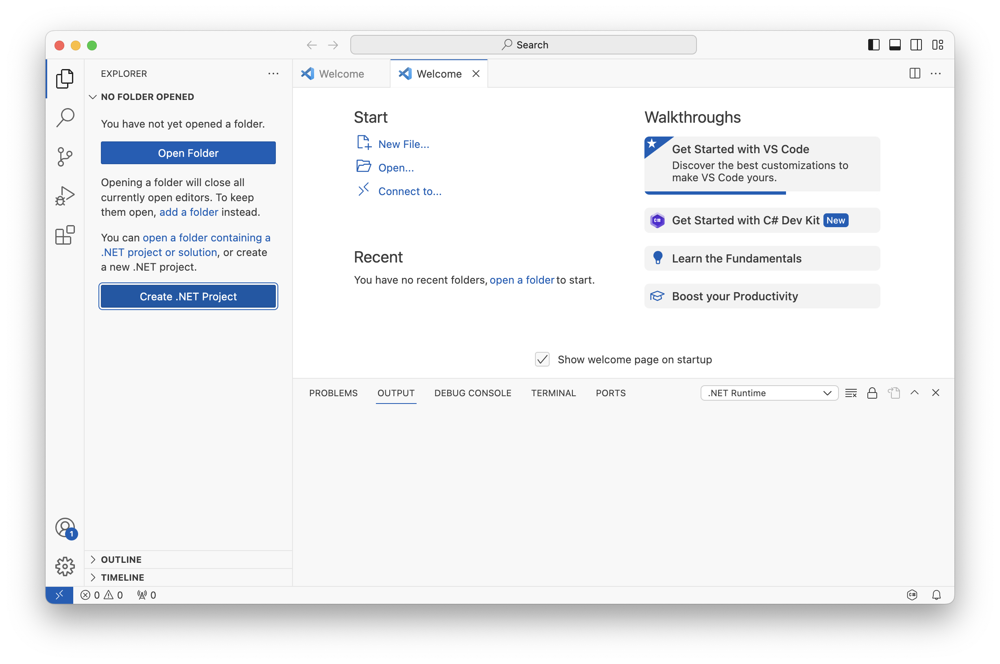

Let's create a quick Hello World project to see everything works correctly.

Click on **Create .NET Project**

The first time you do this, Visual Studio Code will download some additional stuff, which can take a few seconds (and the only feedback is some console messages, that are easy to overlook). 

Wait until the **Select a template to create a new .NET project** dropdown opens at the top of the Visual Studio Window.

Begin to type **Console** and then choose **Console App**.

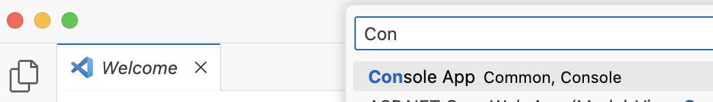

Choose a folder.

Sometimes Visual Studio will (once again) download stuff in the background. Once it's done choose a name for your project.

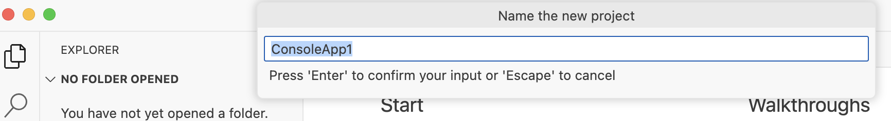

A security warning pops up (whose purpose only Microsoft understands, since we are creating a new project...) Trust yourself!

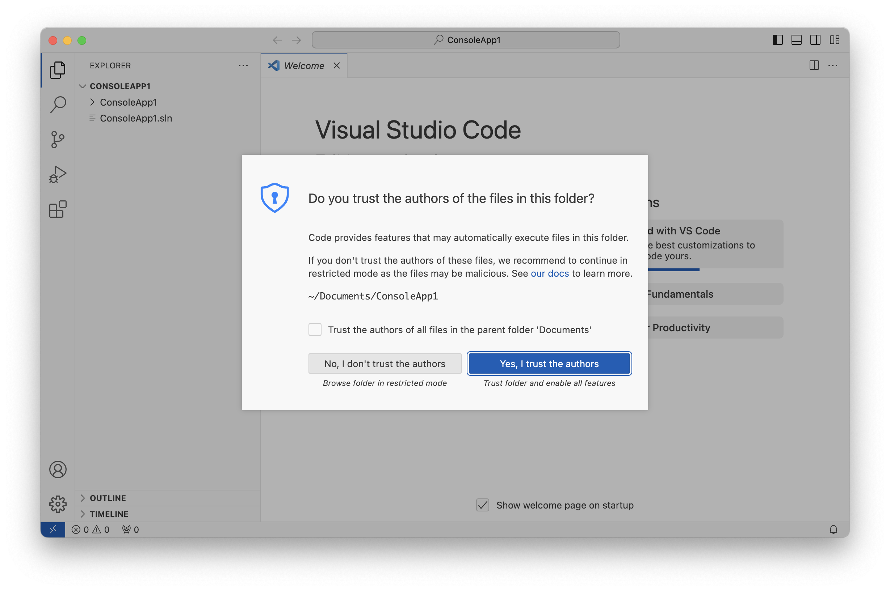

Unfold the folders on the left side. This is where project is organized.

Click on **Program.cs** — this is the main source file for your app. 

In the default app, it just writes "Hello World" to the console output. With **Program.cs** selected, press the **Run and Debug** icon in the left toolbar.

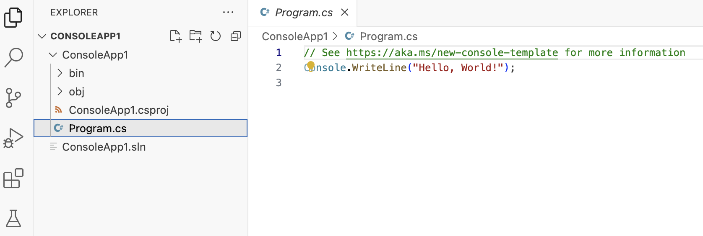

Click on the **Run and Debug** button. 

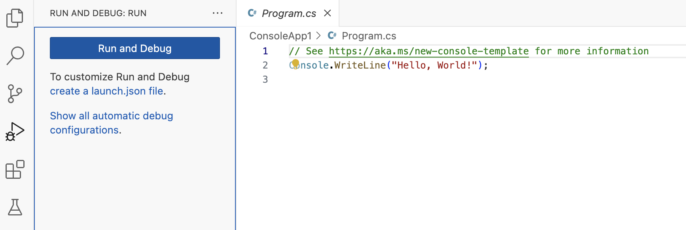

The first time you do this, Visual Studio Code will ask you which debugger to use.

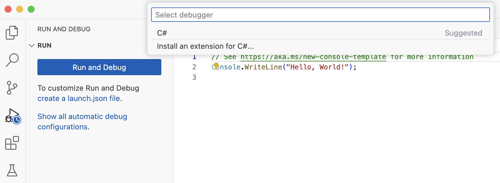

**Choose C#**, and you are finally done. The application will compile and start. 

There will be a number of diagnostic messages displayed when the application runs, but in the midst of this, you will see **Hello World** as expected.

You have successfully installed Visual Studio Code with C# support. 

(It seems to be harder than it needs to be, but hey, you're done now!)

## Opening and running the PicoGK test project in Visual Studio Code

Choose **File->Open Folder**

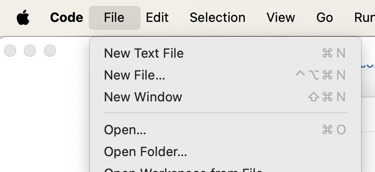

Browse to the **PicoGK Example** project folder and open it.

You will receive the warning again, whether you want to trust the authors of this folder, it's **yes** again.

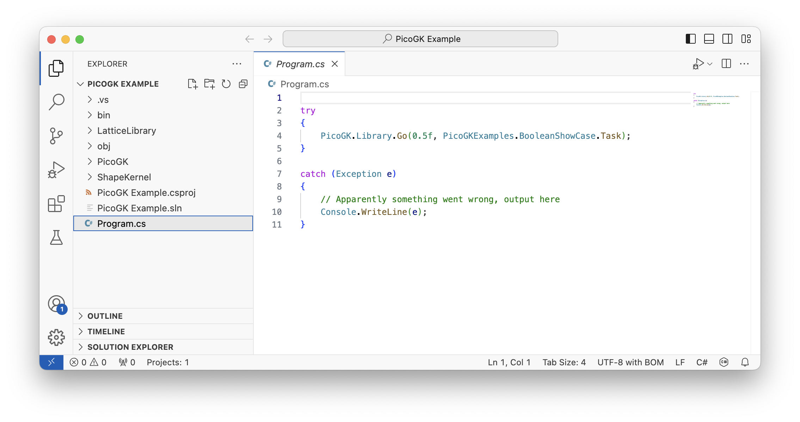

With Program.cs selected, choose again **Run and Debug**.

If you receive any additional security warnings, [check out this page on how to silence them.](MacSecurity.md)

You should now have the default PicoGK example open in your viewer.

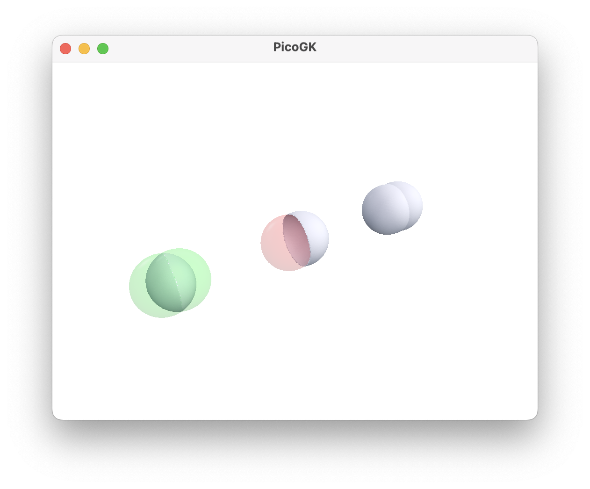

**Congratulations. You are up and running with Visual Studio Code and PicoGK.**

Return to the [Main PicoGK Documentation](README.md)