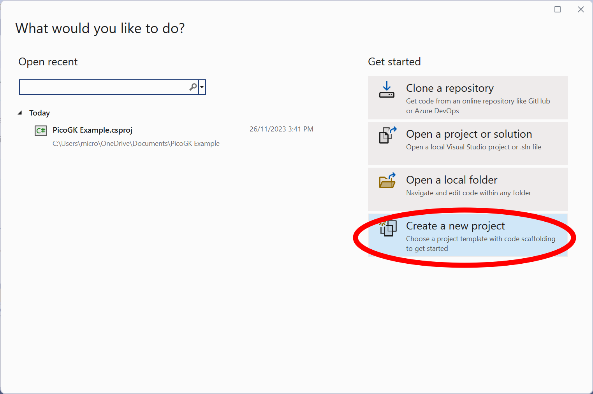
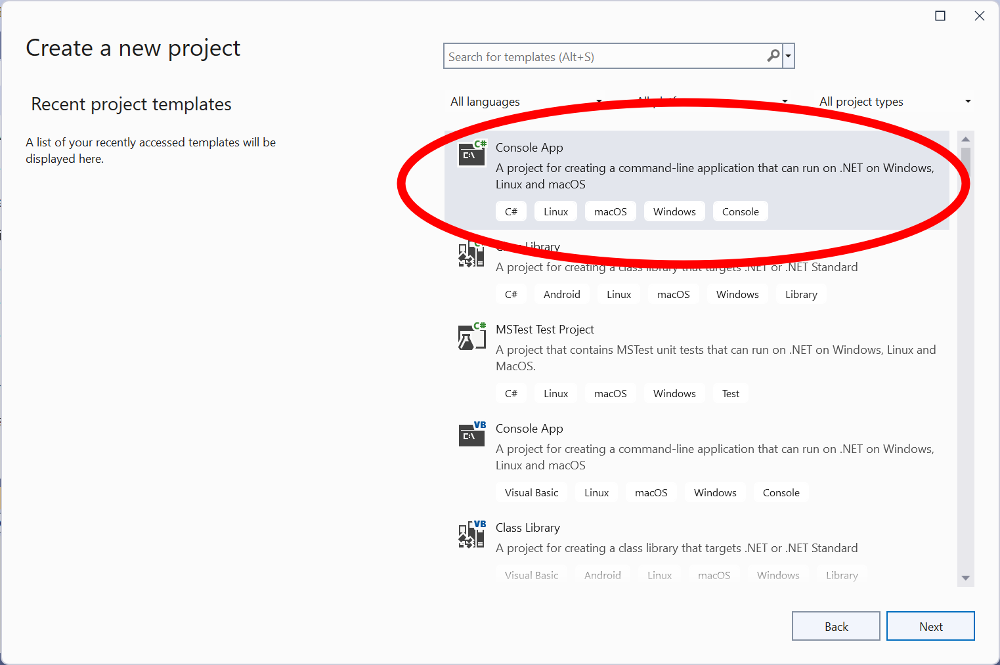
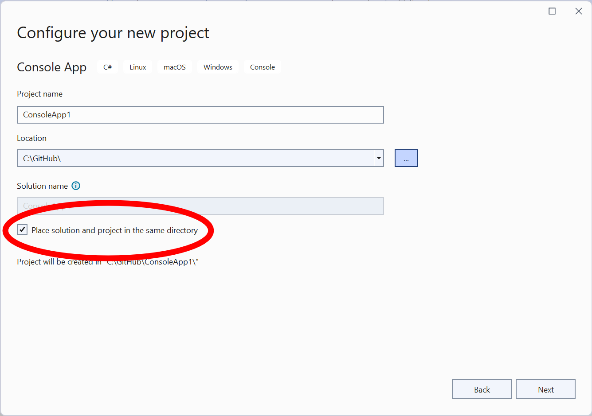
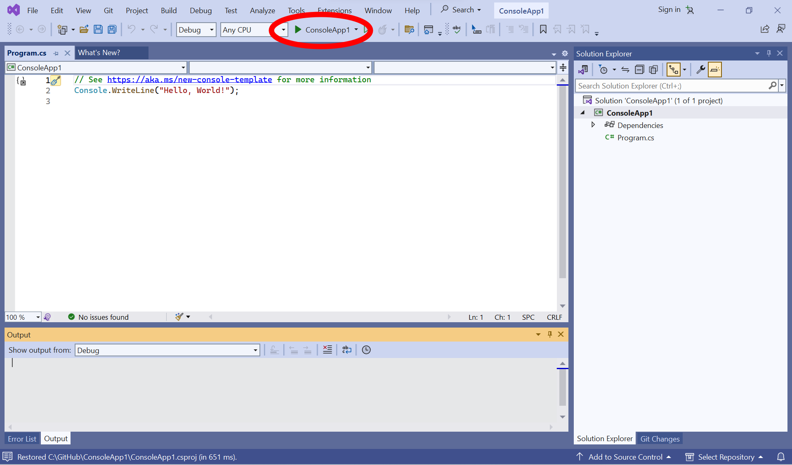

# Creating an empty C# Console Project

[Click here to scroll down to Visual Studio Code instructions.](#Visual-Studio-Code)

## Visual Studio 2022

On the Welcome Screen choose **Create a new project** (or choose **File->New->Project** from the menu)

Choose Console App 

Give your project an name and place it in the desired folder. If you check the indicated box, your folder hierarchy is a bit flatter (recommended).

Accept all defaults in the next boxes and create your project.

Your new application is ready to run by clicking the Run button in the top center of the screen.

You can now add the PicoGK and other submodules and replace the contents of Program.cs to launch the PicoGK Library.

## Visual Studio Code

On the left toolbar, choose the bottom icon, called **Manage**. Choose **Command Palette** 

Choose  **.NET: New Project**

Begin to type **Console** and then choose **Console App**.

Choose a folder and then a name for your project.

At first launch, a security dialog asks you to trust the source code in the folder (which you just created). So obviously you trust yourself....

With **Program.cs** selected, press the **Run and Debug** icon in the left toolbar.

Click on the **Run and Debug** button. 

The first time you do this, Visual Studio Code will ask you which debugger to use.

**Choose C#** The application will compile and start. 

You can now add the PicoGK and other submodules and replace the contents of Program.cs to launch the PicoGK Library.