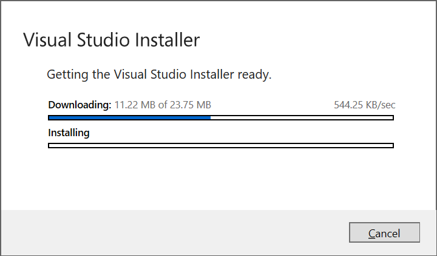
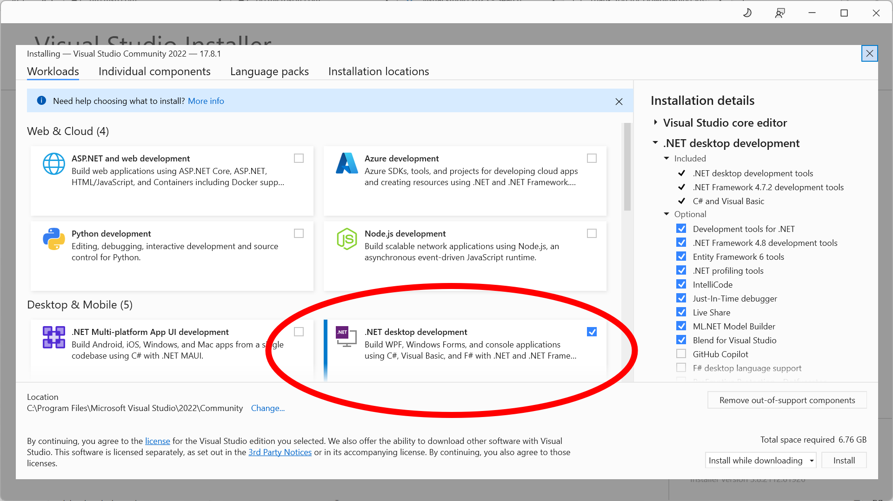
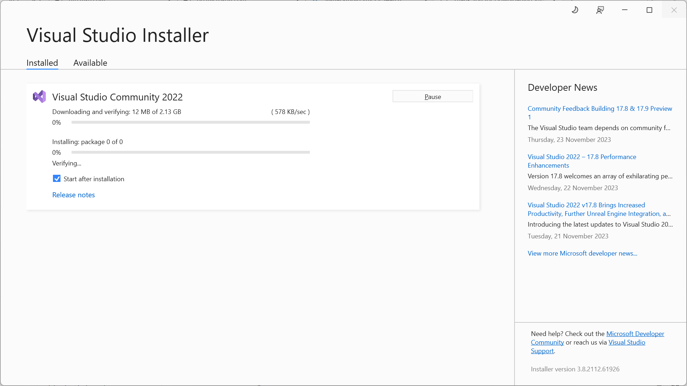
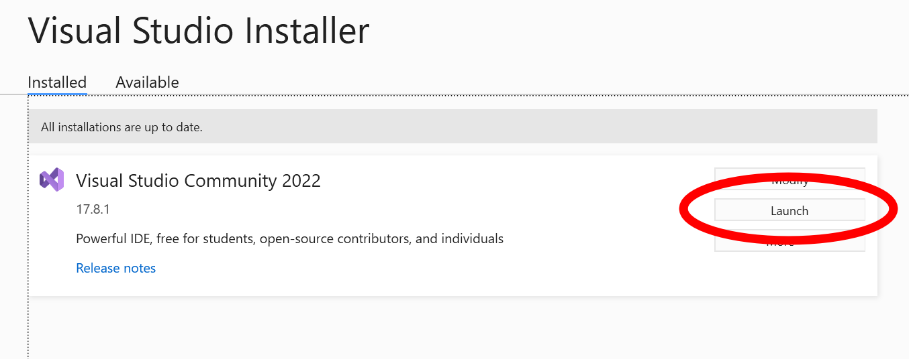
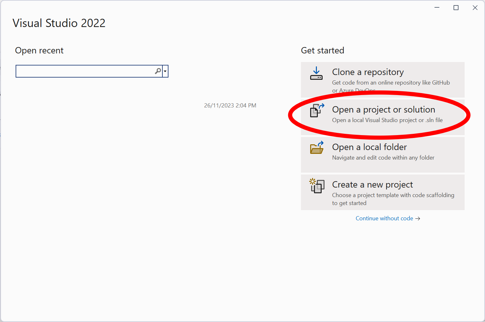
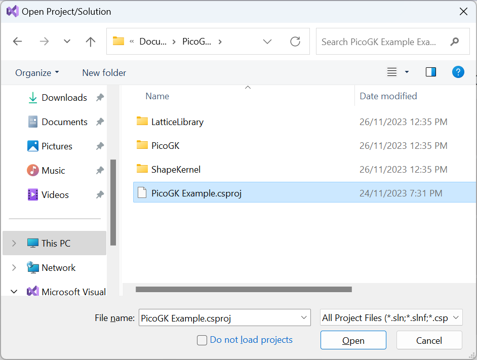
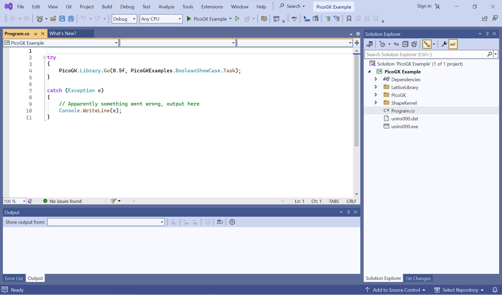
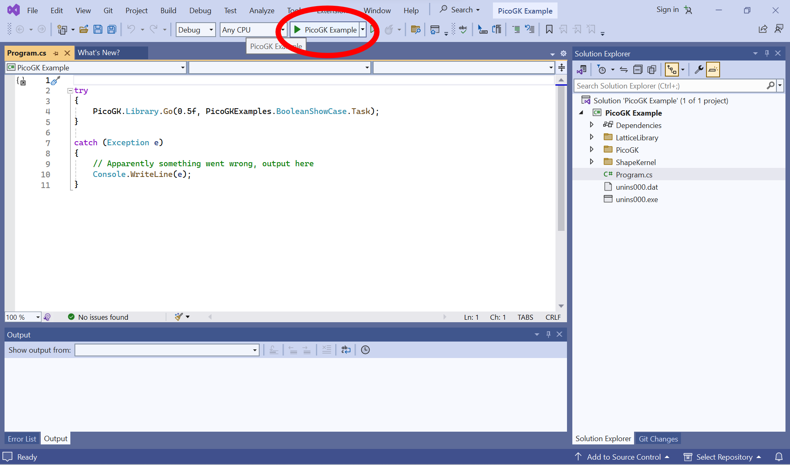

# Installing and running Visual Studio 2022

**Note** we show Windows screenshots. Mac is similar. 

If you are on Mac, you should know that Visual Studio has been end-of-lifed for Mac. [You might want to use Visual Studio Code instead](VisualStudioCode_FirstTime.md).

## Download and Install Visual Studio 2022

Download Visual Studio 2022 Community Edition (or higher) from: https://visualstudio.microsoft.com/vs/community/ and run the installer.

Agree to the licensing terms and wait for the download of the installation package.

Select .NET desktop development and accept the defaults by clicking on Install.

Wait for the installation to finish.

After VisualStudio 2022 is installed, click the Launch button.

*Also, close the installer after you launched Visual Studio. Sometimes Visual Studio needs to install additional packages, and this process fails, if the installer is still running in the background.*

Congratulations, you have Visual Studio up and running.

## Running the PicoGK Example Project

After you launched VisualStudio, you the welcome screen is shown. **Choose Open a project or solution**

Browse to where you installed the PicoGK demo project (default is **Documents/PicoGK Example**)

Choose **PicoGK Example.vcproj**

The example project will open in Visual Studio. On the right side, you see your project files. **Program.cs** contains the main source code of the example.

Click on Program.cs to show the source code.

Click on the run PicoGK Example button at the top center of the screen.

Visual Studio will now compile the example project and launch it.

Your screen should look like this after you clicked run. 

**Congratulations. You are up and running with Visual Studio and PicoGK.**

Return to the [Main PicoGK Documentation](README.md)