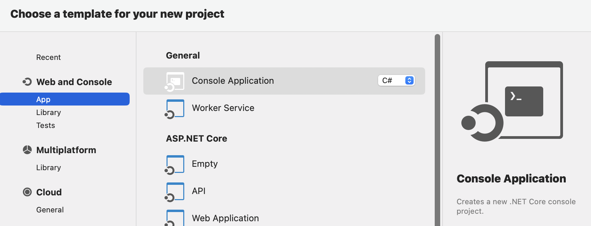
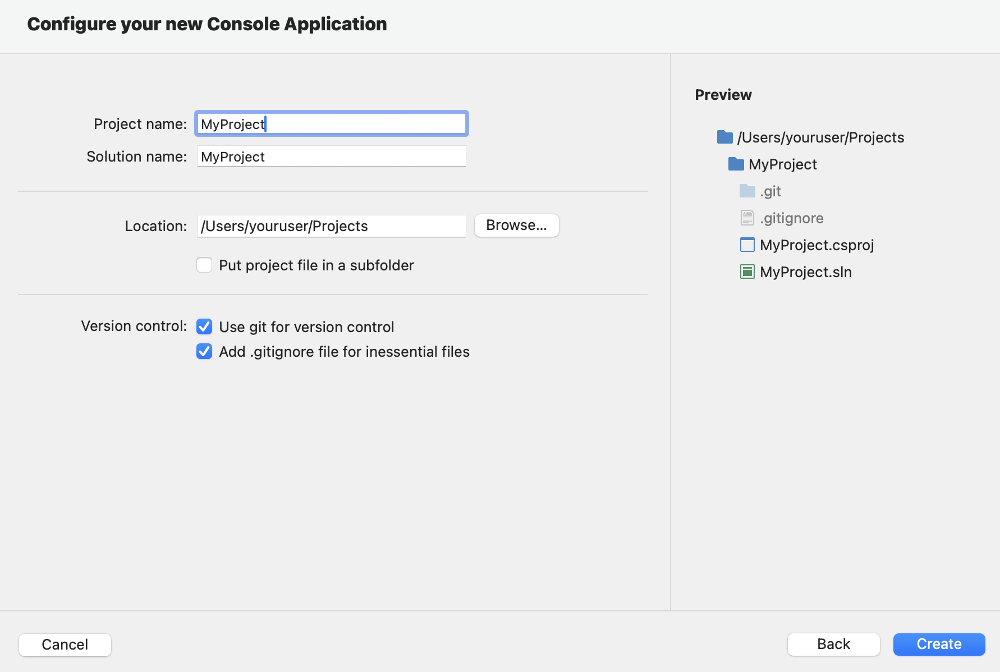
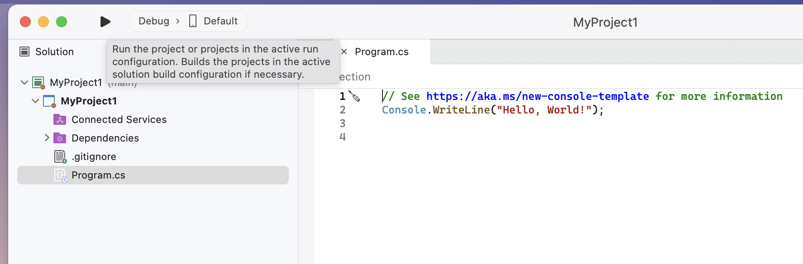
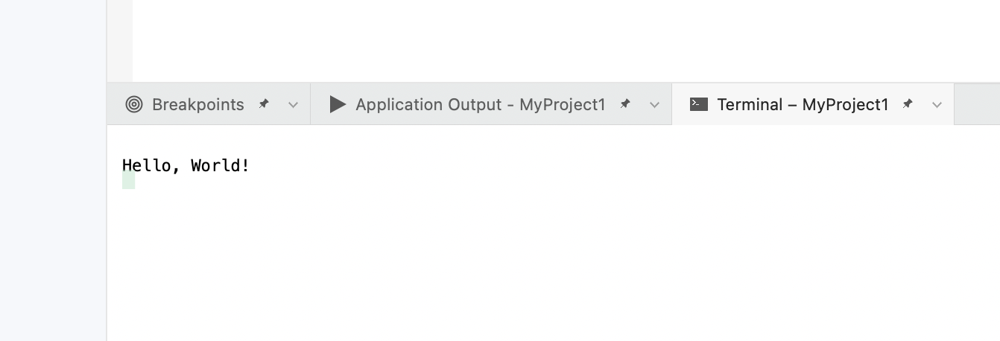

# PicoGK Installation

## If you have used C# and Github before

- Create a new **C# Console** application project using the latest version of Microsoft Visual Studio

- Create a new repository for your project using **git**.

- Add the **[PicoGK repository](https://github.com/leap71/PicoGK)** as a submodule and initialize it.
- Go into the **PicoGK** submodule folder, and navigate to the subfolder **Runtime**
- If you are on Mac, copy the **.dylib** file you see there to **/usr/local/lib**
- If you are on Windows, copy the **.dll** file to **C:\SYSTEM32**
- If you don't want to pollute these directories, you can change the path to the PicoGK Runtime in PicoGK__Config.c#

Return to the [Getting Started](README.md) page to see how to run your first PicoGK app.

## Beginner's Installation Guide

PicoGK uses C#, a modern and elegant language, that can be learned quickly, but has powerful features. In order to use C#, you have to install Microsoft Visual Studio for either Mac or Windows. 

- If you are on Mac, [you can download it here.](https://visualstudio.microsoft.com/vs/mac/)
- If you are on Windows, [you can download it here.](https://visualstudio.microsoft.com/vs/community/)

When installing, make sure you enable C# support and desktop app development. You don't need anything else.

Open Visual Studio, and create a new "Console" application. 

We are showing Mac screenshots, Windows looks similar.

Click continue until you have to give your project a name.

Click **Create**.

Your screen should look like this or similar. Click on the run button to compile and run your program.

You will see something like that in the console output at the bottom. Congratulations, you have run your first C# program.

Now, let's install the PicoGK library.

- Download [the ZIP from this link](https://github.com/leap71/PicoGK/archive/refs/heads/main.zip), which is the PicoGK library.
- Copy the ZIP to the folder which contains Program.cs (in the project you just created)
- Unzip it. Now your folder should contain Program.cs, and a subfolder named PicoGK
- Go into the PicoGK folder, and navigate to the subfolder Runtime
- If you are on Mac, copy the **.dylib** files you see there to /usr/local/lib
- If you are on Windows, copy the **.dll** files to C:\SYSTEM32

Now you are all set and can write your first PicoGK application. 

Return to the [Getting Started](README.md#your-first-picogk-app) page to see how to run your first PicoGK app.