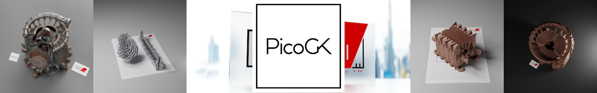
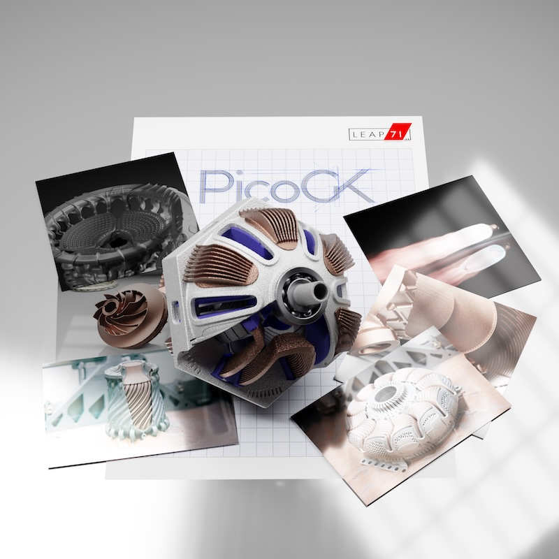

# Welcome to PicoGK

PicoGK ("peacock") is a compact, robust, and fast geometry kernel for Computational Engineering. 

PicoGK was developed by [Lin Kayser](https://github.com/LinKayser), and is maintained by [LEAP 71](www.leap71.com). PicoGK is released under the [Apache License 2.0](https://www.apache.org/licenses/LICENSE-2.0).

For more information, please visit https://PicoGK.org

We believe that [Computational Engineering](https://leap71.com/computationalengineering/) will profoundly change the way we design physical objects in the years to come. But it needs a neutral, transparent and free and open-source platform in order to be adopted widely.

By developing and maintaining PicoGK, we hope to make a contribution to accelerate the progress of invention.

## Getting started

**To get started with PicoGK, please jump over to the [documentation](Documentation/README.md).** and [install the latest PicoGK release](https://github.com/leap71/PicoGK/releases).

To understand what can be done with PicoGK, what other modules we have, we recommend checking out the [LEAP 71 Github Overview Page](https://github.com/leap71) — this page also has pointers to articles about the fundamentals of Computational Engineering.

## On the shoulders of giants

We are indebted to other Open-Source projects, without which writing PicoGK would have been an impossible task. Most notably we use the Academy Software Foundation's [OpenVDB library](https://www.openvdb.org/), which provides the majority of the functionality neccessary to build a robust geometry kernel. In many ways, PicoGK is a thin-yet-powerful layer of functionality on top of OpenVDB.

The PicoGK viewer relies on the [GLFW library](https://www.glfw.org/), for simple cross-platform OpenGL user interface functionality.

## PicoGK structure

PicoGK consists of two modules. 

- **PicoGK**, which is the C#-based project that you have currently open, and

-  **PicoGKRuntime**, a C++-based runtime library, which is in a [separate GitHub project](https://github.com/leap71/PicoGKRuntime).

**PicoGK** provides an framework based on [Microsoft's open-source C# language](https://dotnet.microsoft.com/en-us/languages/csharp). It depends on PicoGKRuntime for the heavy lifting.

**PicoGKRuntime** exposes a minimal "extern C" interface, which can be implemented by other geometry kernels, including commercial ones. 

We encourage other software vendors to support the PicoGKRuntime API and release commercial alternatives to our open-source project. PicoGK was developed as a reliable common interface that you, the engineer, can always rely on as a free and universally available platform to fall back on when creating your own intellectual property.

**PicoGK**, the C# code, which you have open right now, provides rich functionality based on the PicoGKRuntime interface. It makes it as simple as possible to build computational geometry.

You will, however, ususally not use PicoGK directly to build Computational Engineering Models. We encourage you to look at our other open-source project, the [LEAP 71 ShapeKernel](https://github.com/leap71/LEAP71_ShapeKernel), which was written by Josefine Lissner, and forms the basis of all objects we create at LEAP 71 and uses PicoGK as the foundation.

[Please head over to our documentation, for how to get started with PicoGK.](Documentation/README.md)
