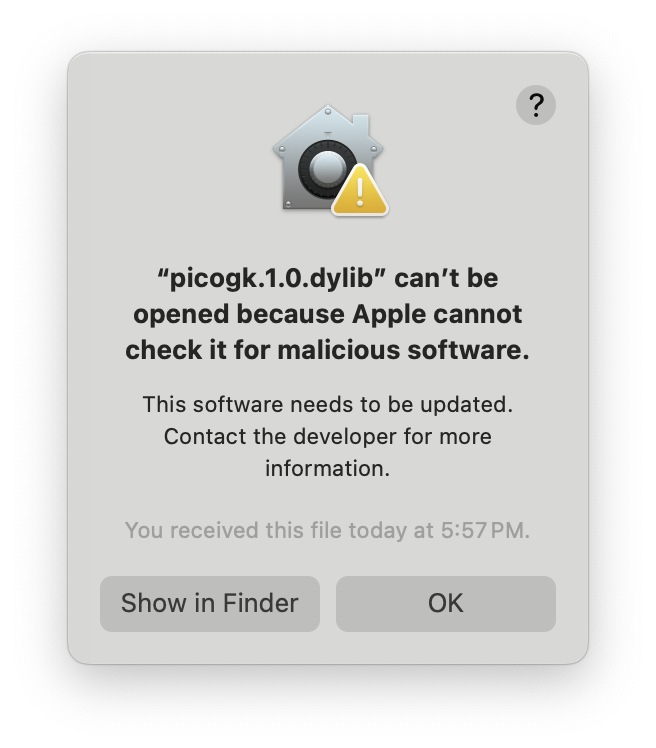
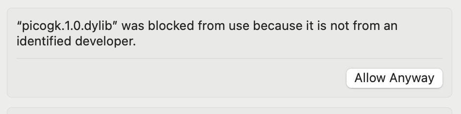

# PicoGK Runtime security on MacOS X

If you receive the following warning on Mac

Please head over to your Privacy and Security settings and click on **Allow Anyway** — [alternatively you can compile](../Documentation/Compiling_PicoGKRuntime.md) and self-sign the runtime yourself.

After you have changed this, it should work.